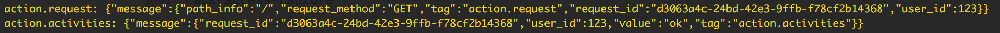
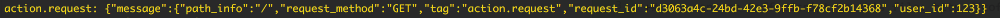
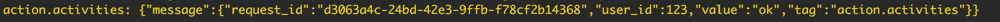
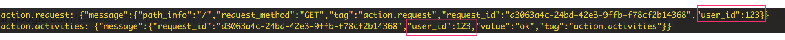

# Rack::ActionLogger

[](https://circleci.com/gh/wapa5pow/rack-action_logger)
[](https://badge.fury.io/rb/rack-action_logger)
[](https://codeclimate.com/github/wapa5pow/rack-action_logger)

**Rack::ActionLogger** is a tool to collect user action logs via fluentd, Rails.logger or any custome logger.

It is intended to collect user request log, action log and any other custome logs.

**Rails 4 or Rails 5** is required to use it.

## Sample Logs



Under example folder, there are sample Rails applications to see how these sample logs are created.

## Installation

Add this line to your rails application's Gemfile:

```ruby
gem 'rack-action_logger'
gem 'fluent-logger'
```

And then execute:

```
bundle
```

Then, add Rack::ActionLogger as middleware to config/application.rb.

```ruby
config.middleware.use Rack::ActionLogger
```

Under config/initializers, add the following files.
^^
### fluent_logger.rb

```ruby
Fluent::Logger::FluentLogger.open
```

### rack-action_logger.rb

```ruby
Rack::ActionLogger.configure do |config|
  config.emit_adapter = Rack::ActionLogger::EmitAdapter::FluentAdapter
  config.wrap_key = :message
  config.logger = Rails.logger
end
```

If wrap_key is nil, the out put does not have parent key of wrap_key.

## Usage

### Enable Request Log

Add the following code to 'app/controllers/application_controller.rb'.

```ruby
include Rack::ActionLogger::ControllerConcerns::RequestLog
```

Request log should looks like this.



Request can be customized by creating new request log concern.


### Add Append Log

Add the following code to any code on any times.

```ruby
Rack::ActionLogger::Container.set_append_log({ value: 'ok' }, 'action.activities')
```

Action log should looks like this.



### Override log attributes

Overriden attributes are added to both request and append logs.

```ruby
Rack::ActionLogger::Container.merge_attributes({ user_id: 123 })
```




## Development

After checking out the repo, run `bin/setup` to install dependencies. Then, run `rake spec` to run the tests. You can also run `bin/console` for an interactive prompt that will allow you to experiment.

To install this gem onto your local machine, run `bundle exec rake install`. To release a new version, update the version number in `version.rb`, and then run `bundle exec rake release`, which will create a git tag for the version, push git commits and tags, and push the `.gem` file to [rubygems.org](https://rubygems.org).

## Contributing

Bug reports and pull requests are welcome on GitHub at https://github.com/wapa5pow/rack-action_logger. This project is intended to be a safe, welcoming space for collaboration, and contributors are expected to adhere to the [Contributor Covenant](http://contributor-covenant.org) code of conduct.


## License

The gem is available as open source under the terms of the [MIT License](http://opensource.org/licenses/MIT).

